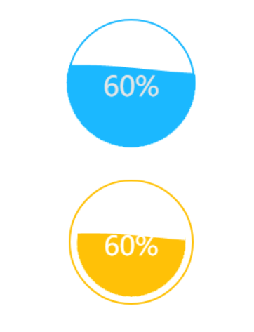

## h-liquid 水球图

头部直接引入即可使用：
```
<script src="./h-liquid.js"></script>
```

#### [在线演示](http://note.youdao.com/)

## 用法示例
```
<div id="test"></div>
```

```
var option = {
	el: 'test', //元素id
	value: 60, //值--为number
	//color: 'green', // 水波的颜色
	//textSize: 40, //文本大小
	//textColor: '#e6e6e6', //文本颜色
	//borderColor: 'red', //圆边框颜色
	//borderWidth: 2, //圆边框宽度
	//borderOffset: 10,   //圆内边距的距离
	//background: 'red', //背景颜色
	//waveHeight: 5, // 波纹幅度
	//waveWidth: 6, //波纹宽度（密集度）
	//speed: 1, // 波动速度
	//anime: false // 开启动画
}
```

## 效果

